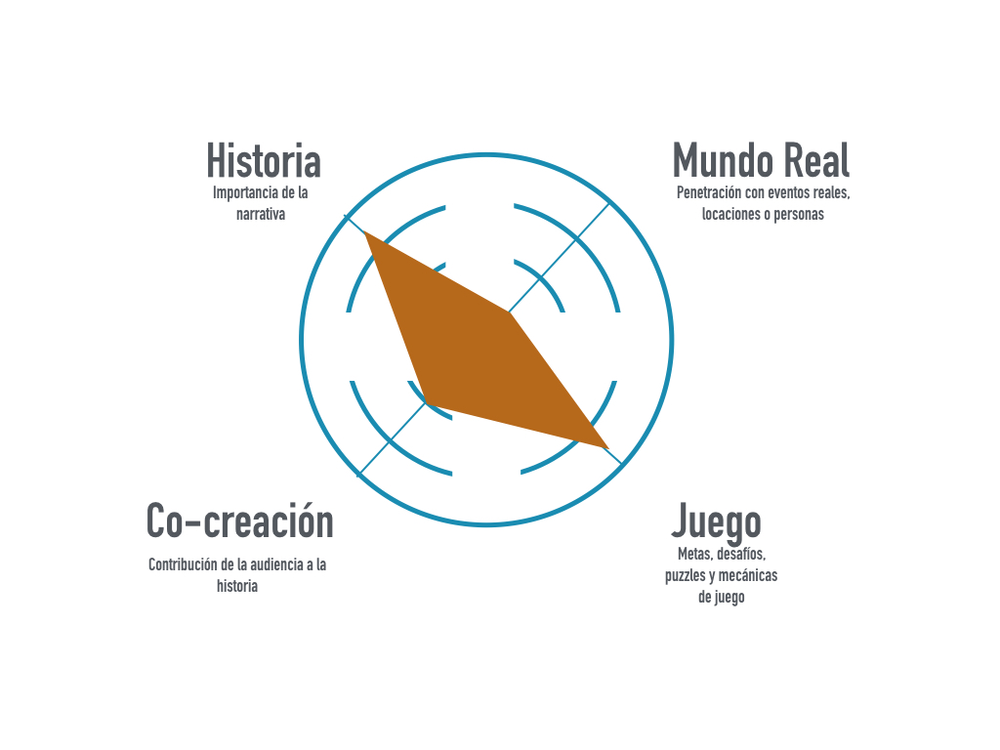

# formulasecreta
Proyecto de Narrativas Transmedia en Nuevos Medios

**Título** : “La fórmula: descubre el secreto oculto de la cerveza a través de la realidad aumentada”

**Autor(es)** : Patricia Jarpa Candia

**Resumen** :  Con este proyecto se propone crear una experiencia en realidad aumentada que ofrece la creación de una narrativa digital dentro de un contexto de expansión del mensaje publicitario, usando el móvil como medio de transmisión del mensaje.

**Logotipo**: 

**Slogan** (frase motivadora/inspiradora): "Descubre el secreto oculto de la cerveza"

**Hashtag**  #augmentedreality #realidadaumentada #storytelling #transmedia 

**Licencia**  :    CC BY-NC-SA

**Fecha** : 2020

**Medios** (donde se tiene presencia):
* WebPage (github url): [Fórmula Secreta](https://pjarpa.github.io/)
* Twitter
* Instagram
* Yotube
* Vimeo
   
----

### Metodología

Metodología de desarrollo: Diseño de contenidos digitales mediante estrategia de diseño de Experiencias de usuario (UX experiences) y Narrativas Transmedia

### Etapa 1: Ideación de proyecto 

**Necesidad/oportunidad**:

El uso de tecnologías innovadoras y nuevas formas de comunicación que permitan construir una mirada actual y reflexiva sobre los mensajes publicitarios en el contexto de los nuevos medios, presentan las siguientes oportunidades y necesidades: 
- Innovar con una fórmula poco explotada en publicidad digital.
- Aparición de clientes que necesitan servicios de comunicación novedosos para llamar la atención del mercado y diferenciarse de su competencia.
- Atender al crecimiento de público interesado en nuevas formas de contenido y entretenimiento.

**Descripción de la experiencia**:

Se pretende construir una historia principal emplazada dentro de la realidad aumentada, con un inicio obligado, transitando luego por una narrativa modular en que el usuario puede elegir distintos caminos a recorrer, dependiendo de su interés y curiosidad, enfrentándose a desafíos y juegos. Sólo al final del recorrido, en un punto común para todas las líneas narrativas, el usuario deberá responder a un cuestionario donde se pondrá a prueba sus capacidades de investigación, reconociendo en esa acción la fórmula secreta, que ha sido el motivo de inicio de la experiencia.

Se propone además medios de expansión donde los usuarios podrán acceder a información complementaria de la historia, así como para compartir ideas y opiniones. Para ello se proyecta la creación de una página web especial o Wiki 
con datos sobre lugares y personajes que inspiraron la narración, recomendaciones de maridaje y música, además de un espacio creativo llamado Historia Exquisita donde los usuarios podrán seguir expandiendo la historia a partir de una línea narrativa no desarrollada en la historia original y que permitirá, a través de la colaboración colectiva, ir construyendo un nuevo texto literario.

También se tendrá una extensión en redes sociales, para ofrecer narrativas en relación a la historia principal, a través de contenido aparentemente creado por los personajes principales, sea a través del hilado de mensajes del personaje el Escritor en la red de microblogging de Twitter, o el posteo en Instagram de el Camarero. 

La experiencia de realidad aumentada considera el que los usuarios pueden compartir y comentar su fórmula con amigos o conocidos colocando las etiquetas fórmulasecreta y micerveza, permitiendo con ello la viralidad de la experiencia en redes sociales y el alcance a otros posibles consumidores del producto.
   

**Estilo de narración**:

La audiencia se sumergirá en la historia a través del rol de la protagonista, la detective Carolina Bravo, que a través de la elección de pistas y de entrevistas, deberá descubrir cuál es la fórmula secreta tras una enigmática cerveza. El medio principal será la Realidad Aumentada, cuya vía de acceso será a través de marcadores o imágenes activadoras que formarán parte del empaque de la marca y que serán capturados a través del móvil del usuario. El relato al interior de la realidad aumentada se propagará a través de distintos formatos, utilizando imágenes 3D y 2D, audios, videos, y textos para generar la experiencia de inmersión en la historia, así como la inclusión de redes sociales y página web para aportar información, ampliar la narración y permitir acciones para promover la participación del usuario.

### Etapa 2: Prototipar / productos 

(Productos que has desarrollado y como se plantea la integración de los diferentes medios) 

**Análisis funcional de la experiencia**: 

*Diagrama de flujo de usuario*:

*Esquema narrativo de la historia*:

*Diagrama radar de la experiencia transmedia*:

**Diseño Visual de la experiencia para móvil (tratamiento gráfico de los elementos de la interfaz)**

*Paleta de color*:  

 

*Propuesta de marcadores*: 

 

*Wireframe de experiencia*: 

*Pantalla de visualización de la experiencia*: 

**Publicidad**:

**Integración de Medios**: Mementos es una app para móviles que ocupará redes sociales para la generación de contenido geolocalizado y la tecnología de Realidad Aumentada para visitar lugares donde se despliegue este contenido. Los usuarios podrán subir su contenido geolocalizado desde la aplicación de móviles para compartirla con otros usuarios. El usuario podrá decidir que su mensaje sea publicado con una delación de 1 día hasta 1 año.

**Visualización de prototipo**: Para explicar las funcionalidades de la APP y realizar un primer testeo de usuarios se ha creado una presentación disponible en la Web de [Mementos](https://pjarpa.github.io/) y realizada con herramientas digitales de creación de contenido audiovisual y web como [Keynote](https://www.apple.com/keynote/), [Adobe Premiere](https://www.adobe.com/es/products/premiere.html?gclid=CjwKCAjwhOD0BRAQEiwAK7JHmKVr-f-qO2F457a8P5b5suklSkl3_UMS_SZCwGQH3BEqYnxsWhqU9hoCBJsQAvD_BwE&sdid=8DN85NTQ&mv=search&ef_id=CjwKCAjwhOD0BRAQEiwAK7JHmKVr-f-qO2F457a8P5b5suklSkl3_UMS_SZCwGQH3BEqYnxsWhqU9hoCBJsQAvD_BwE:G:s&s_kwcid=AL!3085!3!340831002958!e!!g!!adobe%20premiere), [After Effects](https://www.adobe.com/es/products/aftereffects.html?gclid=CjwKCAjwhOD0BRAQEiwAK7JHmNEtYyzbHxPOh7i5NC16nAzmaLRA0Z-5NcYdmSWFmrpkHDgoa1IQIhoCEfMQAvD_BwE&sdid=8DN85NTQ&mv=search&ef_id=CjwKCAjwhOD0BRAQEiwAK7JHmNEtYyzbHxPOh7i5NC16nAzmaLRA0Z-5NcYdmSWFmrpkHDgoa1IQIhoCEfMQAvD_BwE:G:s&s_kwcid=AL!3085!3!340859134298!e!!g!!after%20effects) y [Rapidweaver](https://www.realmacsoftware.com/rapidweaver/)

**Programación de prototipo de APP**:
Utilización de software libre [Aumentaty](http://www.aumentaty.com/index.php) para el desarrollo de la experiencia en RA (Realidad aumentada) y de [Skope](https://play.google.com/store/apps/details?id=com.aumentaty.scope&hl=en_US) para la visualización de contenidos a través del móvil. Primera fase de desarrollo para experimentar con las posibilidades de la realidad aumentada en plataformas iOS y Android. Etapa aún en fase de construcción.

### Etapa 3: Técnicas de evaluación utilizadas

(Estrategia que plantearías para evaluar tu propuesta, medidores e indicadores de éxito, elige / propone) 

* El prototipo de la APP Mementos será evaluada en una primera fase a través de la APP de [Skope](https://play.google.com/store/apps/details?id=com.aumentaty.scope&hl=en_US) que permitirá obtener feedback de los usuarios que accedan al contenido de prueba.
* La presencia del proyecto en Redes Sociales (Twitter, Instagram) permitirán abrir un canal de comunicación con los usuarios de la app, además de habilitar un formulario de contacto en la misma página del proyecto [Mementos](https://pjarpa.github.io/)

----

### Conclusiones y trabajo futuro

* Grado de consecución del proyecto:
Mementos pretende ser una app innovadora en su campo de interés y acción. Si bien existen actualmente aplicaciones que funcionan como "Cápsulas del tiempo" o herramientas de mensajes diferidos en el tiempo, estás más bien se orientan a un consumo personal y particular, no colaborativo ni menos como una forma de aporte social. El plus además de la inclusión de la Realidad Aumentada como componente tecnológico, propone una forma interesante de enriquecer la experiencia de los usuarios de redes sociales, potenciando la experiencia no sólo en el campo digital sino también en el mundo real.

* Problemas identificados  (técnicos / sobre la idea inicial / planificacion) 
En esta primera fase de propuesta las principales dificultades han sido los conocimientos técnicos y uso de herramientas, tanto de software como de hardware disponibles para concretar el proyecto en realidad aumentada. Además se debe trabajar aún en el desarrollo adecuado de flujo de interfaz de usuario (UI) que permita una mejor planificación de la experiencia de usuario (UE), de los recursos y los tiempos para el desarrollo de la app.

* Propuestas de mejora (por qué consideras que merece la pena continuar)
Es un proyecto que tiene un gran potencial de desarrollo, si bien en su inicio podría ser limitada en cuanto a sus funcionalidades, ésta puede ser de gran interés para el público que se interese por su uso y que encuentre en ella novedosas formas de aplicar el contenido de Realidad Aumentada creada en este sistema en otros campos de interés como la educación o la investigación.

* Posible interés del proyecto (¿ Quien podría  colaborar / involucrarse en el proyecto? ¿viable?)
Posibles colaboradores podrían ser diseñadores y programadores que se sientan motivados a trabajar en un equipo colaborativo para la producción de una app de estas características, teniendo en cuenta que para la generación de este producto es factible utilizar herramientas open source  que disminuyan los costos de implementación y no sea tan difícil su distribución para su testeo en un grupo de usuarios de prueba. También se apuesta a captar eventuales inversores que podrían encontrar alguna utilidad en las funcionalidades de Memento, ya sea estamentos públicos o privados como museos, organizaciones educativas o de promoción del turismo.

----

**Referencias y recursos utilizados** :

*Referencias*:

* [Proceso UX](https://uxmastery.com/resources/process/)
* [Diseño de Experiencias UX](http://www.nosolousabilidad.com/articulos/uxd.htm) 
* [Métodos UX](https://mgea.github.io/UX-DIU-Checklist/index.html) 
* [MuseMap: ejemplo de experiencia UX](https://blog.prototypr.io/musemap-street-art-app-ux-case-study-9bec6a99823b) 
* [Experiments with Google: AR Experiments](https://experiments.withgoogle.com/collection/ar)
* [Awwards-The awards of design, creativity and innovation on the internet](https://www.awwwards.com/)
* [ARCore - build new augmented reality experiences](https://developers.google.com/ar/)
* [Six Top Tools to Build Augmented Reality Mobile Apps](https://www.infoq.com/articles/augmented-reality-best-skds/)
* [Chris Milk - Interactive Work](http://milk.co/interactive)
* [Qué es y para que sirve un análisis funcional](https://www.fhios.es/para-que-sirve-un-analisis-funcional/)
* [Front End & Back End Development](https://www.coursereport.com/blog/front-end-development-vs-back-end-development-where-to-start)
* [Appinventor](https://appinventor.mit.edu/)

*Productos utilizados*: 

* [Aumentaty - Software de creación de contenidos con realidad aumentada ](http://www.aumentaty.com/index.php)
* [Skope - App para visualización de contenido en RA](https://play.google.com/store/apps/details?id=com.aumentaty.scope&hl=en_US)
* [Sketch - Plataforma de diseño gráfico](https://www.sketch.com/)
* [Coda 2 - Editor de código web](https://panic.com/coda/)
* [Rapidweaver - Software de diseño web](https://www.realmacsoftware.com/rapidweaver/)
* [Scapple - Mapa de conceptos](https://www.literatureandlatte.com/scapple/overview)
* [Github](https://github.com/)
* [Trello](https://trello.com/patriciajarpa1/boards)
* [Keynote - Software de Presentaciones](https://www.apple.com/keynote/)
* [Adobe Premiere - Programa de Edición de Video](https://www.adobe.com/es/products/premiere.html?gclid=CjwKCAjwhOD0BRAQEiwAK7JHmKVr-f-qO2F457a8P5b5suklSkl3_UMS_SZCwGQH3BEqYnxsWhqU9hoCBJsQAvD_BwE&sdid=8DN85NTQ&mv=search&ef_id=CjwKCAjwhOD0BRAQEiwAK7JHmKVr-f-qO2F457a8P5b5suklSkl3_UMS_SZCwGQH3BEqYnxsWhqU9hoCBJsQAvD_BwE:G:s&s_kwcid=AL!3085!3!340831002958!e!!g!!adobe%20premiere) 
* [After Effects - Programa de efectos de video](https://www.adobe.com/es/products/aftereffects.html?gclid=CjwKCAjwhOD0BRAQEiwAK7JHmNEtYyzbHxPOh7i5NC16nAzmaLRA0Z-5NcYdmSWFmrpkHDgoa1IQIhoCEfMQAvD_BwE&sdid=8DN85NTQ&mv=search&ef_id=CjwKCAjwhOD0BRAQEiwAK7JHmNEtYyzbHxPOh7i5NC16nAzmaLRA0Z-5NcYdmSWFmrpkHDgoa1IQIhoCEfMQAvD_BwE:G:s&s_kwcid=AL!3085!3!340859134298!e!!g!!after%20effects)

